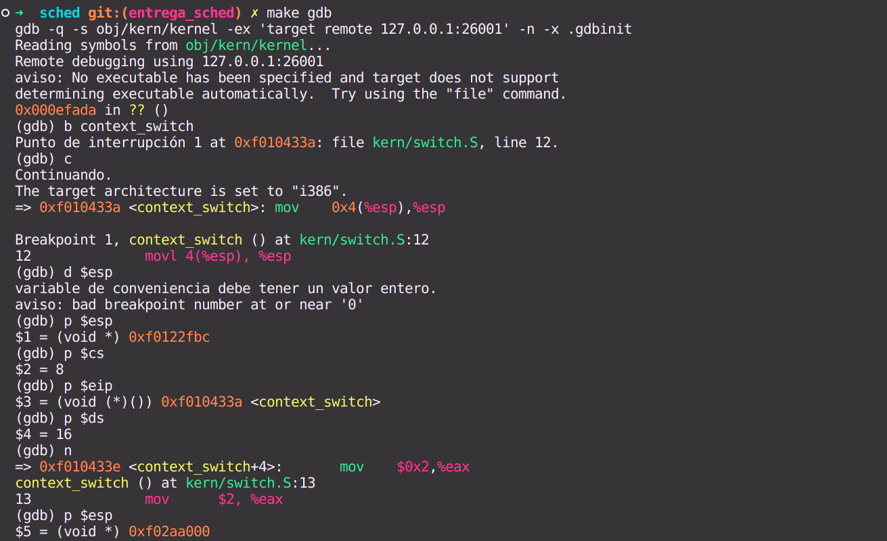
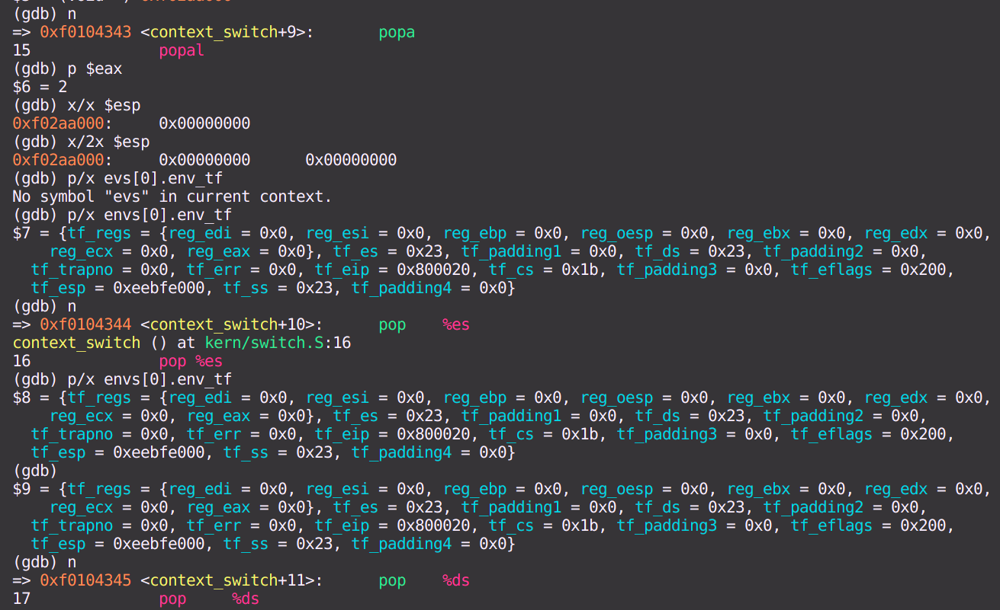
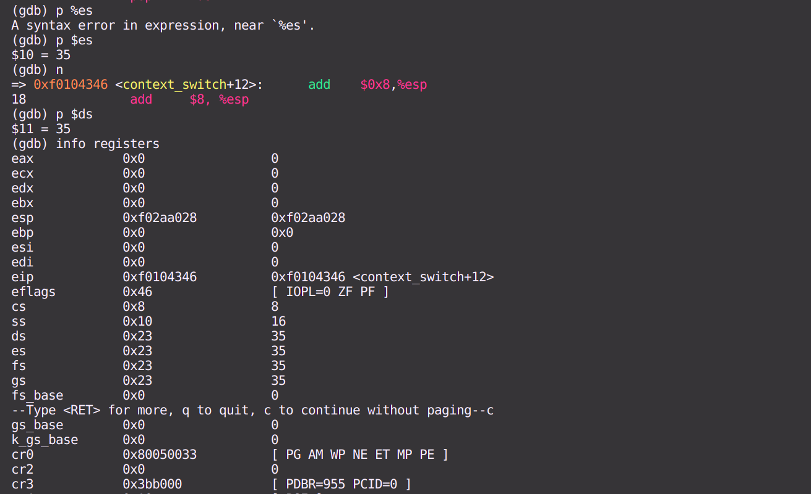
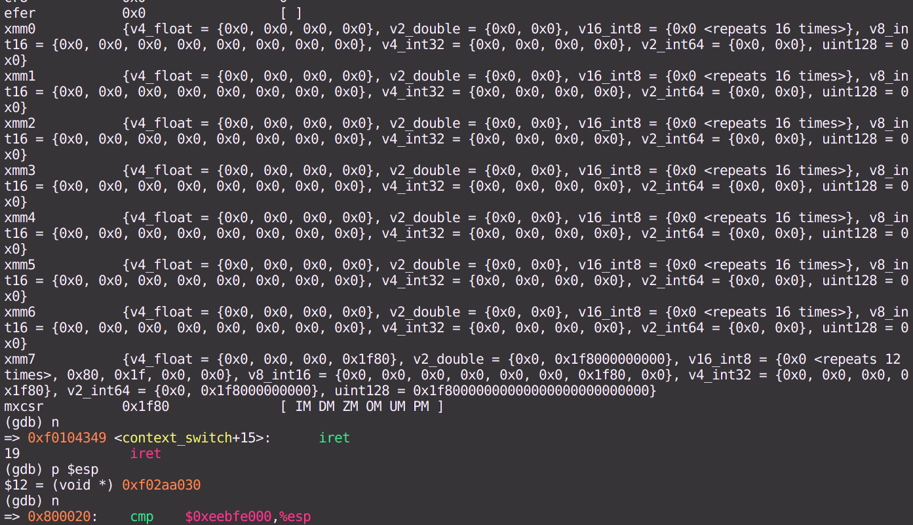
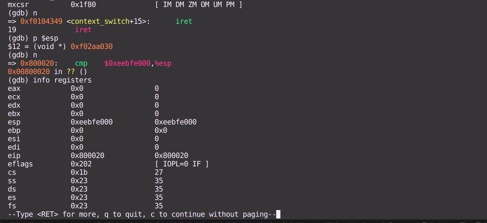

# sched

## Instrucciones para correr los tests
Dado que tuvimos conflictos con las versiones de Ubuntu utilizadas con qemu, añadimos al repo un dockerfile para correrlo de forma uniforme. Las instrucciones para correr el docker son:
- `docker build -t fisop:18.04 .` en el directorio raiz del repositorio (no dentro de /sched)
- `docker run -it --rm --name=lab-sched fisop:18.04 bash` abre una terminal
-  De ser necesario más de una terminal: `docker exec -it lab-sched bash`
- `cd sched`
- `make grade RR=true` corre los tests con RounRobin
- `make grade LT=true` los corre con LotteryScheduling

Para salir del docker `Ctrl+D`.
Consideraciones: Cada vez que se realice un cambio en el código, se deberá volver a buildear el docker. Si no deja buildear, ejecutar docker con sudo.

## GDB - visualización cambio de contexto
En estas capturas vemos el cambio de contexto, los registros más importantes al comienzo de la llamada a `context_switch`, como cambia el stack mientras vamos pasando de instrucciones, y finalmente como se modifican los registros luego de ejecutar `iret`.

## Scheduler - lottery

### Funcionamiento
El scheduler de loterry implementado funciona de la siguiente manera:
- Cada proceso tiene un ticket, que es un número entero positivo. Inicialmente todos los procesos iniciados tienen 
INITIAL_TICKETS (50) tickets.
- Cuando se ejecuta un proceso, se le resta un ticket. El mínimo de tickets que puede tener un proceso es 1. A excepción de los procesos en estado ENV_FREE que estarán en 0 tickets.
- Cuando se ejecuta el scheduler, se elige un número aleatorio entre 0 y el total de tickets de todos los procesos en estado RUNNABLE. Si la cantidad total de tickets es 0 puede ser uno de estos dos casos:
    1) No hay más procesos, en ese caso se llama a sched_halt()
    2) Sólo queda un proceso actual que esta en estado RUNNING, de ser así se sigue ejecutando este.
- Se recorre la lista de procesos, sumando los tickets de cada uno hasta que la suma sea mayor al número aleatorio. Si se da el caso de encontrar más de un proceso que tenga la misma cantidad de tickets (y esa cantidad es la "ganadora") se almacenan en una lista y se vuelve a elegir de esos un proceso aleatoriamente.
- En caso de no haber más de un proceso con la misma cantidad "ganadora", se elige ese y se ejecuta.

Para la elección del número aleatorio, se utiliza next_random(). Esta función se implementó en el trabajo llevado a cabo por la Universidad de Virginia en la implementación de un Lottery Scheduler, ver referencias. 

## Syscalls implementadas
- `sys_modify_tickets` y `sys_reduce_priority` estas syscalls son para modificar las prioridades de los procesos, es decir, agregar o sacar tickets. `sys_reduce_priority` recibe un numero de tickets y lo setea sólo si es menor a la cantidad actual de tickets del curenv. En cambio, la otra syscall recibe una cantidad a reducir o aumentar, esta se suma a la cantidad de tickets del proceso correspondiente al pid recibido. Ver su documentación para ver una explicación más detallada del funcionamiento. 
- `sys_get_process_ticket` permite obtener la cantidad de tickets del proceso correspondiente al pid recibido por parámetro. Por otro lado, `sys_get_priority` devuelve la prioridad (tickets) del proceso actual.

### Referencias
https://www.cs.virginia.edu/~cr4bd/4414/S2019/lottery.html#adding-the-lottery-scheduling-algorithm  